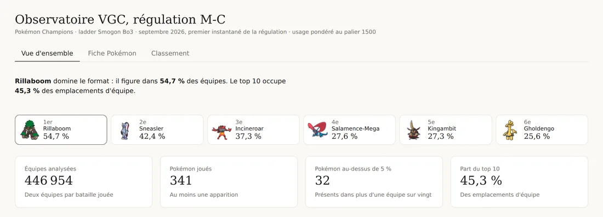
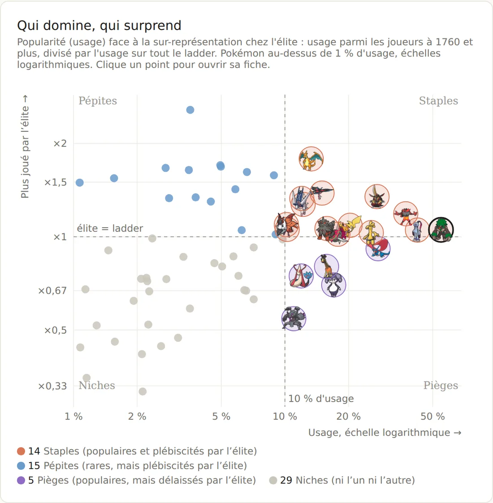

# Observatoire du métagame Pokémon VGC

Suivre des parts de marché sur un marché qui change tous les mois.

Ce dépôt contient un pipeline Python qui archive chaque mois les statistiques
publiques du jeu compétitif Pokémon Champions (format VGC, régulation M-C),
les transforme en modèle en étoile et alimente un tableau de bord décisionnel.

[Étude de cas complète](https://karlfring.github.io/portfolio/vgc.html) ·
[Documentation](docs/) ·
[Guide Power BI](powerbi/GUIDE.md)



## Le problème

Les sites de référence affichent l'état **actuel** du métagame. Aucun ne
conserve d'historique exploitable : impossible de répondre à « qu'est-ce qui a
changé depuis le mois dernier, et qui l'a adopté en premier ».

Ce projet constitue cet historique, un instantané par mois, et le rend lisible.

### Pourquoi c'est un problème de données « métier »

| Dans le jeu | En entreprise |
|---|---|
| Usage d'un Pokémon | Part de marché d'un produit |
| Classement moyen des joueurs qui le choisissent | Valeur du segment client qui l'achète |
| Coéquipiers fréquents | Produits achetés ensemble, affinités de panier |
| Adversaires qui le mettent en difficulté | Concurrents directs |
| Un instantané par mois | Suivi de tendance et détection de ruptures |
| Staples, pépites, pièges, niches | Matrice de portefeuille, à la manière d'une matrice BCG |

## Résultats du premier mois (septembre 2026)

- **515 299 équipes** analysées, **259 Pokémon** joués au moins une fois.
- **Rillaboom figure dans une équipe sur deux** (50,9 %). Le top 10 occupe
  45,3 % des emplacements d'équipe.
- Croiser la popularité avec le niveau des joueurs donne quatre profils :
  **13 staples, 20 pépites, 5 pièges, 31 niches** parmi les 69 Pokémon
  au-dessus de 1 % d'usage. Détail de la méthode : [docs/methode-quadrants.md](docs/methode-quadrants.md).



## Architecture

```
smogon.com/stats  (fichiers texte publiés le 1er du mois)
        │
        ▼
src/fetch.py      téléchargement poli, archive idempotente, empreinte SHA-256
        │
        ▼
src/parsers.py    expressions régulières : usage, movesets, matchups
        │
        ▼
src/ingest.py     modèle en étoile en CSV  ──►  data/processed/
        │
        ▼
Power BI · tableau de bord   (mesures DAX dans powerbi/mesures.dax)
```

Le workflow `.github/workflows/ingest.yml` s'exécute **le 2 de chaque mois** :
il lance les tests, ingère le nouveau mois et commite les données. Chaque
évolution du métagame est ainsi traçable à un commit.

## Modèle de données

Un schéma en étoile : quatre dimensions (Pokémon, date, régulation, palier de
classement) et cinq tables de faits.

| Table | Grain | Mesures principales |
|---|---|---|
| `fact_usage` | mois × palier × Pokémon | `usage_pct`, `raw_count`, `real_pct`, `rang` |
| `fact_moveset` | + type d'attribut × valeur | `pct`, `viability_ceiling` |
| `fact_teammate` | + Pokémon partenaire | `teammate_pct` |
| `fact_counter` | + Pokémon adverse | `score_matchup`, `ko_pct`, `switch_pct` |
| `fact_snapshot` | un fichier ingéré | `total_battles`, `sha256`, `ingere_le` |

Choix de conception et dictionnaire des colonnes : [docs/modele-de-donnees.md](docs/modele-de-donnees.md).

## Qualité des données

15 tests couvrent les parsers et les bornes du calendrier de publication. Deux
d'entre eux verrouillent des bugs réels qui ne faisaient rien planter mais
faussaient silencieusement les résultats : [docs/journal-qualite.md](docs/journal-qualite.md).

## Utilisation

```bash
pip install -r requirements.txt

python src/ingest.py                      # régulation courante (M-C), 4 paliers
python src/ingest.py --paliers 0 1760     # sous-ensemble de paliers

python -m pytest tests/ -q                # 15 tests
```

Les CSV sont écrits dans `data/processed/`, les fichiers bruts archivés dans
`data/raw/`. Un mois déjà archivé n'est jamais retéléchargé.

## Structure

```
src/config.py       régulation suivie, paliers, politesse réseau
src/fetch.py        téléchargement, archivage, calendrier de publication
src/parsers.py      parsing des formats texte Smogon
src/ingest.py       orchestration et construction du modèle en étoile
tests/              15 tests et fichiers témoins
powerbi/            guide de montage et mesures DAX
docs/               modèle de données, méthode, journal qualité
```

## Feuille de route

- [x] Ingestion Smogon (usage, movesets, matchups ; 4 paliers)
- [x] Modèle en étoile et traçabilité des instantanés
- [x] Automatisation mensuelle et tests
- [x] Tableau de bord : vue d'ensemble, quadrants, fiche par Pokémon, classement
- [ ] Évolutions mois par mois (à partir des données d'octobre, publiées le 1er novembre)
- [ ] Écart élite / reste du ladder à partir des paliers 0 et 1760
- [ ] Résultats de tournois pour mesurer un taux de conversion en phase finale
- [ ] Extension à la régulation M-D

## Éthique de collecte

- Aucune API officielle : les fichiers sont des exports statiques publics.
- Deux secondes entre deux requêtes, avec un User-Agent identifiant le projet.
- Données agrégées uniquement : aucune donnée personnelle de joueur.

## Crédits

Données : statistiques mensuelles publiques de [Smogon University](https://www.smogon.com/stats/).
Pokémon © Nintendo, Creatures, GAME FREAK et The Pokémon Company. Projet de
fan non commercial, réalisé dans le cadre d'un portfolio de data analyst.

Auteur : [Karl Akpovi](https://www.linkedin.com/in/karlakpovi) ·
[portfolio](https://karlfring.github.io/portfolio/)

## Licence

Code sous licence MIT. Les données restent la propriété de leurs auteurs (Smogon University) et les marques Pokémon celle de leurs ayants droit.
